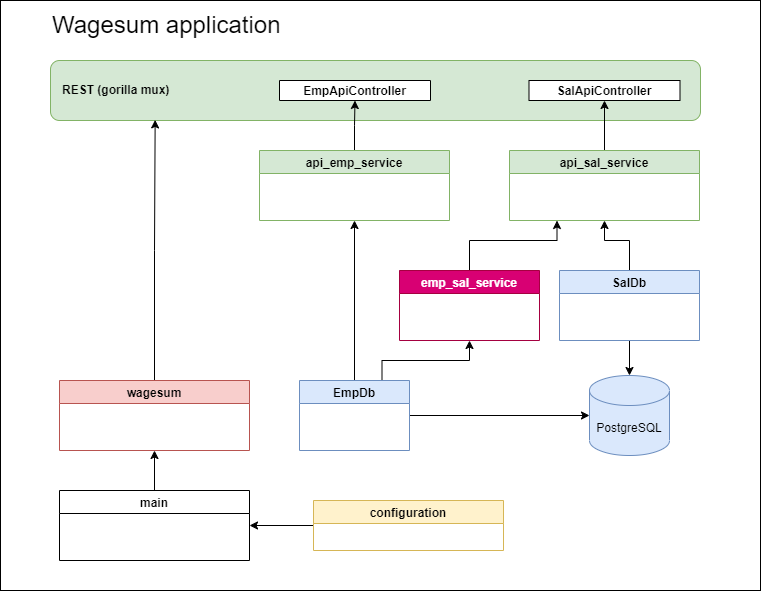

# Golang outlook

## Intro
During this year I had a chance to participate on 
[Go programing language](https://en.wikipedia.org/wiki/Go_(programming_language))
training. These courses are useful for golang 101, however if you would like
to try it and take a snapshot, then [Tour of Go](https://go.dev/tour/welcome/1)
is the best entry point.

The next level is creating something like working demo application, which 
is more complex compare to _helloworld_ and this can be a test for tooling
as well. I built a wage summary app, which can calculate the sum of 
salaries under managers.



As you can see this is a simple CRUD application with REST interface for request.
PostreSQL is the database and it will handle the long running, recursive
SQL queries with _go routines_.

This blog entry is subjective and of course I don't have the Philosopher's Stone.
From the horses' mounth Go language idea popped up, when creators
were waiting for long running C++ build task... All of them are well-known,
iconic language designers.

## Initial experiences

For me it's like C language with Python flavour, continously watching
Java/Spring Boot features. Creators tried to avoid C++ pitfalls. 
Lot of C++ developers will be happy to use this language, because this is
a good opportunity to entry into microservice world.

Golang has got pointers and _nil_, but no pointer arithmetic and no operator overloading.
I can live without them. Garbage collection is there, but it's built into
binary, not JVM handles that. 

Golang uses static linking. As a result compiler can simplify lot of things
and it can produce only one (!) executable file included everything. In addition
to that dependency management could be easier, it can clean the unused libraries 
with a simple _go mod tidy_ command.

Indentation and code formatting is available by default (!) with a simple _gopls_
command. Look and feel can be the same for all developers. Error handling is
different compare to modern languages' exception handling, 
but you can get used to it. 

Golang is not object oriented language, although it can emulate
some behaviour with _struct_. Python looks similar for me with this:
_func (s MyStruct) f(p param) (RetVal, error){...}_ 

Functional paradigm is not just supported, but recommended. It's easy
to define a function. In wagesum application 
[emp_sal_service_test](../internal/pkg/emp_sal_service/emp_sal_service_test.go)
uses it, however this test class is just scratches the surface. 

In the meantime it's not a secret that C language was the ascendant, 
interoperability is supported, as you can read in 
[this](https://programmer.ink/think/interoperability-between-go-and-c-language.html)
article. There are side effects with that, for example
SQLite driver wanted to use _gcc_. Because of that I drop the support 
although light-weight, in-memory database could be useful for tests.

IMHO [Convention over Configuration](https://en.wikipedia.org/wiki/Convention_over_configuration)
is slightly overused. It is okay that visibility differentiated by 
uppercase/lowercase first character instead of _private_ and _public_,
but comments in test could be asserted... It's too much. I wouldn't
like to see business logic in comment section.

## Openapi and code generation
Our favorite OpenApi generators are familiar with Golang. Thus a good
OpenApi description is enough and your code is prepared.
_API is your first class citizen_. 

```shell
docker run --rm -v ${PWD}:/local openapitools/openapi-generator-cli generate -i /local/api/wagesum-openapi.yaml  -g go-server  -o /local/internal/pkg --additional-properties=noservice,enumClassPrefix=true,featureCORS=false,onlyInterfaces,outputAsLibrary=true,sourceFolder=openapi
```

Unfortunately the generated code is not the latest and cleanest, but it can
give you a good example and some hints. 
Nevertheless golangci/linter will start to cry sometimes. 

In wagesum application you can find generated source code under 
_internal/pkg/openapi_ directory. Services were moved into _service_ 
package, because I had to elude circular dependencies.

## Tooling

Today good programming language's tooling is more important, then
features. Golang works well in this point, lot of tidy tools are 
included by default, plus tons of open source libraries help the 
developers. Most of them are free, open source with friendly
licences.

If you've got Java background, then [gorm](https://gorm.io/index.html)
is alternative for Hibernate. REST interfaces can handled by
[gorilla mux](https://github.com/gorilla/mux) or [echo](https://echo.labstack.com/)
or you can write your own solution even. 

I found [this](https://github.com/golang-standards/project-layout) for
project layout and I tried to follow that. Some developers stay
with _/src_ directory for sources.

[Viper](https://github.com/spf13/viper) has been dropped, because of 
too much dependencies, however it is a powerful tool.
I chose [env](https://github.com/caarlos0/env), because it is
a simple and zero-dependencies library to parse environment variables into structs. 

Various testing frameworks were borned during years, but JUnit/Mockito
is much more common and trivial to use. On the other hand Testing is
by default supported and ready to use. So you can start
[TDD](https://en.wikipedia.org/wiki/Test-driven_development)
from the beginning even if you will extend the functionality with other libraries.

## Go routines

Go routines are the most powerful part of this language. These are 
light-weight threads, which are not bounded to operating system.

Of course it's not unique. You can mention Erlang or [Zio framework](https://zio.dev/) 
in Scala. Zio calls this feature as _fiber_. In Java it will be included
in the near future with [Project Loom](https://openjdk.org/projects/loom/).

Wagesum application uses go routines in
[emp_sal_service](../internal/pkg/emp_sal_service/emp_sal_service.go) 
ILong running, recursive queries will run parallel and processed 
by _channels_.


## Summary

Go is a well designed, well supported programming language with 
fantastic tooling and great community. Small memory footprint,
low processor consumption are trademarks of Golang. 
In the meantime there are many, widely used feature is missing
or not there by design.

With Java background I don't have a feeling that I must migrate
all of my projects to Go. There are Scala and Kotlin and others.
I can be productive with Java much more faster.

Nevertheless Golang is used widely in Kubernetes world, so
it is already successful. A new language is always a new window 
so it's worth a try! 

## Links
* (https://towardsdev.com/golang-productivity-hacks-part-3-auto-generating-test-4c8055dc7946)
* https://eli.thegreenplace.net/2021/rest-servers-in-go-part-4-using-openapi-and-swagger/
* https://stackoverflow.com/questions/7106012/download-a-single-folder-or-directory-from-a-github-repo
* https://ribice.medium.com/serve-swaggerui-within-your-golang-application-5486748a5ed4
* https://github.com/GoogleCloudPlatform/golang-samples
* https://medium.com/@rosaniline/unit-testing-gorm-with-go-sqlmock-in-go-93cbce1f6b5b
* https://medium.com/@ankur_anand/how-to-mock-in-your-go-golang-tests-b9eee7d7c266
* https://nathanleclaire.com/blog/2014/02/15/how-to-wait-for-all-goroutines-to-finish-executing-before-continuing/ 
* https://swagger.io/docs/specification/authentication/oauth2/
